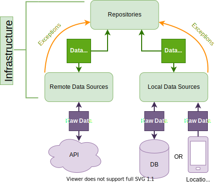

# Infrastructure layer

In this layer you will find all the files that access external services. These could be things like data bases, devices storage, APIs, 3rd party libraries, etc..

## Service

A service is usually a wrapper interface that abstracts the implementation of a library or API.

## Repository

Repositories are reserved for services that perform CRUD operations on a type of Data Object. Usually storing them in a Database or in BackEnd server.